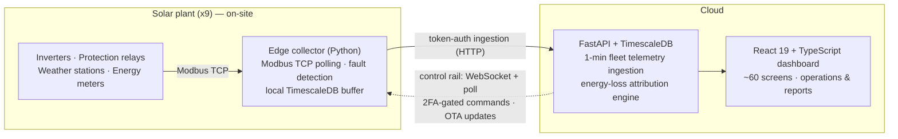

# Gabriel Mendes Bonato

**Full-Stack Software Engineer · Industrial IoT & Energy** — Araraquara, Brazil (GMT-3)

I build software that runs power plants. Lead engineer of **MeuWatt**, a monitoring and
remote-control platform live across **9 utility-scale solar plants** in Brazil.

> The platform is proprietary (private repos, ~320k LOC across 4 repositories, most of it
> authored by me). This page is the case study — I'm happy to walk through the code live
> or share redacted excerpts in an interview.

---

## The platform, end to end

**Edge (sole author):** a containerized Python collector per plant — multi-vendor Modbus
driver registry (Sungrow, Huawei, GoodWe), automatic fault-detection state machine,
resilient polling on flaky field networks. Includes reverse-engineered vendor register
maps that decode fault codes the official docs don't list.

**Cloud API (lead author):** FastAPI + PostgreSQL/TimescaleDB — high-write time-series
ingestion at 1-minute granularity, 114 production schema migrations, and an idempotent,
replay-safe energy-loss attribution engine (peer-baseline modeling). Root-caused a
production database cost overrun to unindexed read paths and fixed it at the
index/query level.

**Remote operations:** an audited command rail (idempotency keys, claim timeouts,
WebSocket + HTTP transports, TOTP 2FA step-up) for real-time equipment control and
over-the-air collector updates — collectors replace their own containers via the Docker
daemon and confirm across the restart. Zero SSH to plant sites.

**Frontend (lead author):** React 19 + TypeScript + Vite dashboard — real-time
monitoring, generation/availability reports, breakdown management, fleet-health admin.

**Delivery:** commit → pytest → GitHub Actions multi-arch image builds → cloud
auto-deploy + Ansible fleet deployment → centralized logging. I run the whole pipeline.

**Field tooling:** a commissioning app technicians run on a laptop inside the plant
network to probe and validate any Modbus device before go-live.

---

## How I work

**AI-native.** Agentic tooling (Claude Code + MCP servers) is my daily method, not a
sidecar: conventions and architecture contracts live in context files agents load every
session, tests and review hold agent output to production quality, and most shipped
code is agent-authored under my direction. Currently building an AI analytics layer on
fleet telemetry — structured time-series into training-ready datasets, ML/LLM insight
pipelines in development.

**Stack:** Python · FastAPI · SQLAlchemy/Alembic · PostgreSQL · TimescaleDB ·
TypeScript · React · Vite · Docker · Ansible · GitHub Actions · WebSockets ·
OAuth2/JWT · TOTP 2FA · Modbus TCP

---

## Contact

📫 gabriel.mbonato.work@gmail.com · [LinkedIn](https://www.linkedin.com/in/g-mendes-bonato/) · Fluent English · Open to remote full-time & contract (energy, climate, industrial IoT)
