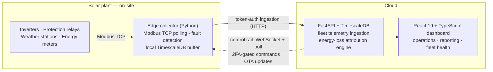

# Gabriel Mendes Bonato

**Full-Stack Software Engineer · Industrial IoT & Energy** — Araraquara, Brazil (GMT-3)

I build software that runs solar plants. Lead engineer of **MeuWatt**, a monitoring and
remote-control platform running across a fleet of utility-scale solar plants in Brazil.

> The platform is my employer's, so the repositories are private. This page is the case
> study — happy to go deep on the architecture and the reasoning behind it.

---

## The platform, end to end

**Edge.** A containerized Python collector per plant, with a multi-vendor device layer:
register maps and drivers for inverters (Sungrow, Huawei, GoodWe), protection relays,
thermal relays, weather stations, energy meters and RS-485 gateways — plus an automatic
fault-detection state machine and polling built to survive flaky field networks.

**Cloud API.** FastAPI on PostgreSQL/TimescaleDB — high-write time-series ingestion and
an idempotent, replay-safe energy-loss attribution engine using peer-baseline modeling.
Traced a production database cost overrun to unindexed read paths rather than write
volume, and returned spend to baseline with targeted indexes and query rewrites.

**Remote operations.** An audited command rail — idempotency keys, claim timeouts,
WebSocket and HTTP transports, TOTP two-factor step-up — covering configuration and
power state for plant equipment, so routine intervention no longer requires sending
someone to the plant. Collectors update themselves over the same rail, delegating a
detached container recreate to the Docker daemon so the update survives the restart it
triggers.

**Frontend.** React 19 + TypeScript + Vite dashboard — real-time monitoring, generation
and availability reporting, breakdown management, fleet-health administration. The daily
working surface for plant operators.

**Delivery.** Commit → pytest → GitHub Actions multi-arch image builds → cloud
auto-deploy and Ansible fleet deployment → centralized logging.

**Field tooling.** A commissioning app technicians run inside the plant network to probe
and validate any Modbus device before go-live.

---

## How I work

**End to end.** I can carry a system the whole way — architecture, data model,
implementation, rollout, and whatever it does in production afterwards. I work best with
real autonomy and a say in the decisions that matter, on a team or on my own.

**In production.** I operate what I ship. Design choices are made with operations in
mind — idempotency, replay safety, observability — because I'm the one who answers when
they're wrong.

**AI-native.** Agentic tooling (Claude Code, MCP) is my daily method. Conventions live in
context files agents load every session; tests and review hold the merge bar. The
leverage is real and the accountability stays mine. Currently building an AI analytics
layer on fleet telemetry — structuring time-series into training-ready datasets and
evaluating ML/LLM pipelines for automated operational insight.

**Stack:** Python · FastAPI · SQLAlchemy/Alembic · PostgreSQL · TimescaleDB ·
TypeScript · React · Vite · Docker · Ansible · GitHub Actions · WebSockets ·
OAuth2/JWT · TOTP 2FA · Modbus TCP

---

## Contact

[gabrielmbona.to](https://gabrielmbona.to) ·
[gabriel.mbonato@gmail.com](mailto:gabriel.mbonato@gmail.com) ·
[LinkedIn](https://www.linkedin.com/in/g-mendes-bonato/)

Fluent English · Open to remote full-time and contract work — energy, climate, and
industrial IoT.
